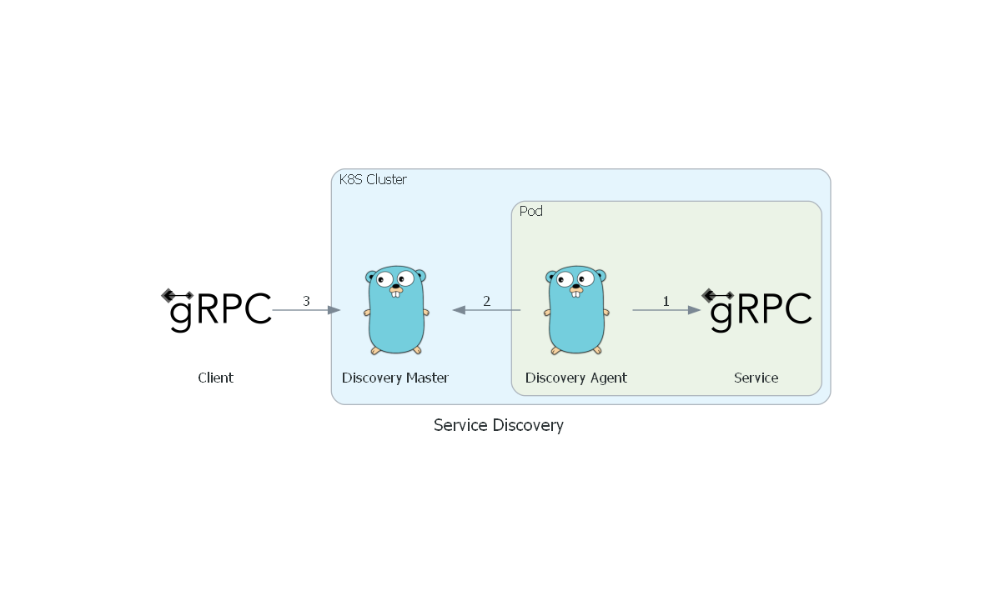

# Service Discovery 
## Overview

This project is an implementation of [Client-Side Discovery Pattern](https://microservices.io/patterns/client-side-discovery.html) intended to use in gRPC projects together Kubernetes (using sidecar pattern).

## Discovery Service  

#### Legend
1. Discovery agent scans the gRPC service to fetch implemented services and health check.
2. Discovery agent sends implemented services and update the status in case of health check failing.
3. Client invokes Discovery Master to get the URL(s) of implementations of desired service.

## Stack

This service is written in GoLang and contains the implementation of Master(gRPC server) and Agent that invokes Reflection and HealthCheck on services and send it over to Master(register and unregister). 

Data Source: SQLite

